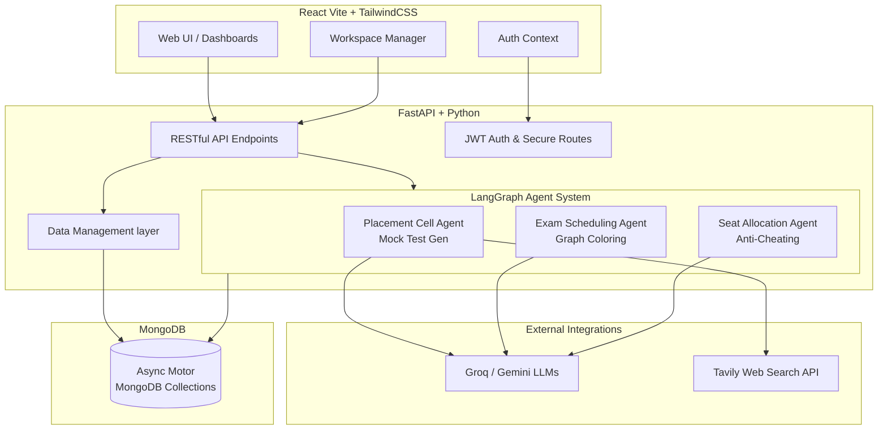

# Campus Agents: Intelligent Campus & Placement Management System
## Comprehensive Architectural & Technical Documentation

This document serves as the exhaustive core reference for writing a research paper on the **Campus Agents** project. It details the complete system architecture, data flow, agentic workflows, database schemas, and the specific underlying algorithms.

---

## 1. Abstract & System Overview
**Campus Agents** is an AI-powered, multi-agent full-stack application designed to automate and optimize two critical aspects of university administration: **Exam Scheduling & Seat Allocation**, and **Placement Cell Interview Preparation**. 

The system leverages Large Language Models (LLMs) orchestrated through **LangGraph**, combined with robust graph-theoretic algorithms and web-research capabilities, to create highly deterministic yet flexible AI agents. The platform supports multi-workspace management, allowing seamless coordination among faculty, administration, and students.

### Core Modules:
1. **Campus Management**: Full CRUD operations for Organization (Departments, Programs), Infrastructure (Buildings, Rooms), Academics (Courses, Exam Cycles), and Students.
2. **Exam Scheduling Agent**: Uses graph coloring to build conflict-free exam timetables with support for human-in-the-loop manual overrides via AI.
3. **Seat Allocation Agent**: Implements an intelligent 4-phase "anti-cheating" seat allocation algorithm.
4. **Placement Cell Agent**: Parses Job Descriptions (JDs), conducts web research (Tavily), infers interview rounds, and generates specific mock tests (Coding, MCQs).

---

## 2. High-Level Architecture Diagram

---

## 3. Technology Stack specifics
- **Backend Framework**: `FastAPI` (Python 3.9+)
- **Agent Orchestration**: `LangGraph` & `LangChain`
- **LLM Providers**: `ChatGroq` (Llama 3 / Mixtral for reasoning)
- **Database**: `MongoDB` (AsyncIO via `Motor`)
- **Web Search**: `TavilySearch` & `DuckDuckGoSearchResults`
- **Frontend**: `React`, `Vite`, `TailwindCSS`
- **Concurrency**: Python `asyncio`, parallel graph node executions.
- **Data Validation**: `Pydantic`

---

## 4. Database Schema Details (MongoDB)
The database named `campus_agent_db` uses discrete collections mapped by a `workspace_id` to allow multitenancy.

- **users**: Stores `email`, `full_name`, and bcrypt `password_hash`.
- **workspaces**: Stores `name`, `owner_id`, and a list of `members`.
- **invitations**: Stores token-based invites to workspaces (`token`, `status`, `invited_by`).
- **students**: Tracks students by `id` (roll number), `name`, `batch_year`, `program_id`, `semester`, and `enrolled_courses`.
- **courses**: Tracks `code`, `name`, `program_ids`, `batch_ids`, and `semester`.
- **programs** & **departments**: Organizational structural entities.
- **buildings** & **rooms**: Infrastructure tracking. Rooms define `rows`, `columns`, and `seating_type` (Single, Two, Three) acting as seating multipliers.
- **exam_cycles**: Links an examination period to a `semester` and `batch_year`, holding calculated `student_ids` and `program_ids`.
- **calendar_events**: Tracks institution holidays to avoid scheduling on them. Dynamic holidays (Sundays, New Year's) are generated virtually.
- **exam_plans**: Stores historically generated exams plans and statuses.
- **generations**: Stores Placement Cell generation histories (inferred rounds, generated tests).

---

## 5. Detailed LangGraph Agent Workflows

The backbone of Campus Agents consists of deterministic finite state machines combined with LLM nodes, coordinated via LangGraph. 

### 5.1 The Placement Cell Agent (Mock Test Generation)

Provides end-to-end interview preparation from raw JD text.

**Graph Nodes & Edges:**
1. **`parse_jd`**: The entry node. Uses a Pydantic-structured LLM to extract `company_name`, `role_name`, and specific `explicit_rounds`. It judges the JD's quality: *explicit*, *partial*, or *missing*.
2. **Conditional Router (`research_router_node`)**: If JD quality is partial/missing or confidence is < 0.7, routes to `web_research`. Else routes to `decide_rounds`.
3. **`web_research`**: Hits the `TavilySearch` API with multiple contextual queries. If Tavily fails, it falls back to DuckDuckGo. Search results are filtered/truncated for token thresholds and an LLM consolidates them across patterns. Cached locally for future identical companies.
4. **`decide_rounds`**: A reasoning LLM consumes the parsed JD and web research context. Applies hard-coded logic: e.g., if finding "Programming Test", translates to a `"coding"` round and `"cs_mcq"` round. Outputs a structured object containing `num_questions_estimate` and `expected_duration_min`.
5. **`expand_rounds_to_test_specs`**: Converts abstract rounds into precise logical architectures (`MockTest` schema). Sizes the difficulty profile based on the total questions.
6. **Parallel Threads (`gen_test_0` to `gen_test_N`)**: LangGraph dynamically routes to 6 parallel nodes to synthesize questions asynchronously. It applies role-aware guidelines (e.g., specific rules for BPO roles vs Software Engineers).
7. **`validate_tests`**: Scrutinizes the generated output (e.g., throwing errors if a Coding round accidentally emitted an MCQ question).

### 5.2 Exam Scheduling Agent (Timetable Generator)

Generates parallelized collision-free exam schedules.

**Algorithms used:** 
- **Graph Coloring Algorithm**: 
  - **Vertices**: Represent each specific Course exam.
  - **Edges**: Added between any two courses that share common students OR are part of the same common academic programs.
  - **Coloring**: The algorithm colors the graph where courses sharing the same color can safely occur in the identical Time Slot without a student conflict. 
  - Nodes are sorted by degree strictly (courses with most conflicts handled first) to optimize density.
  
**Graph Nodes & Operations:**
1. **`setup`**: Ingests configuration like limits per day, holiday dates, start date, slot timings.
2. **`generate_timetable_algo`**: Executes traversing algorithms avoiding blocked out `calendar_events` and weekends. Fills available slots recursively based on the graph colors computed.
3. **Conditional Human-in-the-Loop (`modify_timetable_llm`)**: If the user submits `custom_instructions` (e.g., *"Shift the Physics 101 exam to Next Monday"*), an LLM Agent modifies the purely deterministic timetable while strictly guarding constraints.

### 5.3 Seat Allocation Agent (Anti-Cheating Coordinator)

Disperses students into physical rooms with anti-proximity constraints.

**Algorithms & Phases Used:**
To maximize diversity in seating to prevent cheating, course enrollments are gathered and student subsets are pulled per assigned room. Students are pulled across courses continuously, interleaving their layouts.
- **Phase 1 (Optimal Dispersal - 1 per bench)**: Places students sequentially down the columns in position 0 (the leftmost seat) until exhaustion or reaching the end of the room layout.
- **Phase 2 (Corner Fills)**: Acts on multi-seat benches (Three/Two seats). Scans the left seat occupant's course and seeks a student from a *differing course* to sit on the right-most limit to place distance. 
- **Phase 3 (Middle Fills)**: For three-seater benches, analyzes candidates that differ from *both* the left occupant and right occupant to occupy the middle seat safely. 
- **Phase 4 (Exhaustion)**: Finally dumps any remaining unseated student into remaining null seats.

**Graph Implementation:**
1. **`setup`**: State initialization.
2. **`allocate_algo`**: Runs the 4-Phase mathematical generation. Checks overflow counts per room and provides conflict feedback. Outputs a mapped layout `RoomAllocation` grid.
3. **Conditional overrides (`modify_allocation_llm`)**: An LLM Node structured with `AllocationOutput`. Allows prompts like *"Do not place anyone in the first row"* or *"Ensure student John Doe sits alone"*.

---

## 6. Frontend Execution and Architecture

The application adopts a **Vite + React** single-page application construct leveraging **Vanilla JavaScript (ES6 Modules)** and styled functionally through **TailwindCSS** for layout logic, bound with custom CSS modules providing glassmorphism themes.

- **Main Navigation Hooks (App.jsx)**: Handles deep-linking directly into views (`/dashboard`, `/login`, `/join`).
- **Context Wrappers**: 
  - `<AuthProvider>`: Caches JWT authentication instances bridging the gap synchronously traversing all child layouts.
  - `<ToastProvider>`: A global alert subsystem overlay.
- **Core Components**:
  - `WorkspaceManager.jsx`: Container handling Sidebar layout handling routing logic between the nested modules. 
  - Module Managers (`AcademicManager`, `BuildingsView`, `OrganizationManager`, `StudentsManager`, `ExamAgentView`): Each executes granular `fetch()` transactions towards the specific FastAPI backend endpoints, carrying `Authorization: Bearer <jwt>` tokens.

---

## 7. Security Configurations
- **Authentication**: JWT generated via `jose` and `passlib` implementing the `OAuth2PasswordBearer` scheme for token exchanges against `/auth/login`.
- **Multitenancy Isolation**: Database functions actively perform `$match` clauses strictly paired with authorized `workspace_id`. Cross-workspace bleeding is technically impossible via the data access boundaries. 
- **Permissions Framework**: Role abstraction assumes members of the workspace have identical baseline execution authorities (owner/member hierarchy instantiated but currently unconstrained for wide-team collaborations). 

This document synthesizes everything needed to construct a well-researched methodology section covering algorithms, AI deployment structures, and database persistence architectures for the *Campus Agents* platform.
